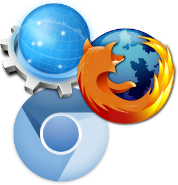
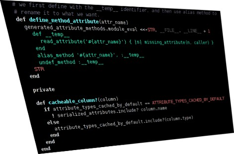

!SLIDE
#Software Libre
## Respeto hacia la libertad del usuario y la comunidad

<!SLIDE bullets incremental transition=fade>
# Libertad: #
* Ejecutar con cualquier objetivo
* Estudiar y cambiar - código abierto como prerequisito
* Redistribuir copias
* Distribuir copias de tu versión modificada

!SLIDE
# Software Libre: Innovación y progreso en la web #

!SLIDE
# Software Libre: Innovación y progreso en la web #

!SLIDE
# Software Libre: Innovación y progreso en la web #

!SLIDE
# Software Libre: Innovación y progreso en la web #

<!SLIDE bullets incremental transition=fade>
# ¿Por qué programar Software Libre?

 * Devolver el favor a la comunidad
 * Idealismo
 * Educación
 * Otros: diversión, reconocimiento, reputación, dinero, mejorar algo existente, etc.

<!SLIDE bullets incremental transition=fade>
# Ventajas del software libre a nivel social
* Autonomía, autogestión
* Difunde la cultura de colaboración
* Refuerza los lazos de solidaridad
* Soberanía, emancipación