!SLIDE
#Datos Abiertos

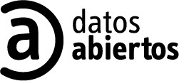

!SLIDE
Es una filosofía y práctica que persigue que determinados datos estén disponibles de forma libre a todo el mundo, sin restricciones de copyright, patentes u otros mecanismos de control. 

Tiene una ética similar a otros movimientos y comunidades abiertos como el <strike>código abierto</strike> *software libre* y el acceso libre.

<!SLIDE bullets incremental transition=fade>
* Completos
* Primarios
* Periódicos
* Accesibles

<!SLIDE bullets incremental transition=fade>
* Procesables
* No discriminatorios
* No propietarios
* Sin licencia

!SLIDE
# WhereDoesMyMoneyGo
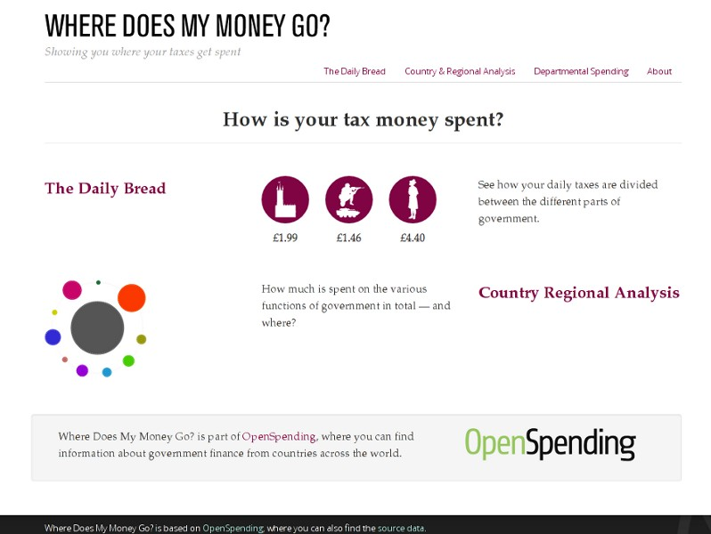

!SLIDE
# MySociety.org
Metas alcanzadas:

* 200.000 personas le escribieron a miembros del parlamento
* 65.000 baches y otros han sido arreglados
* 120.000 reciben mails por cosas que pasan en el parlamento

!SLIDE
# FixMyStreet
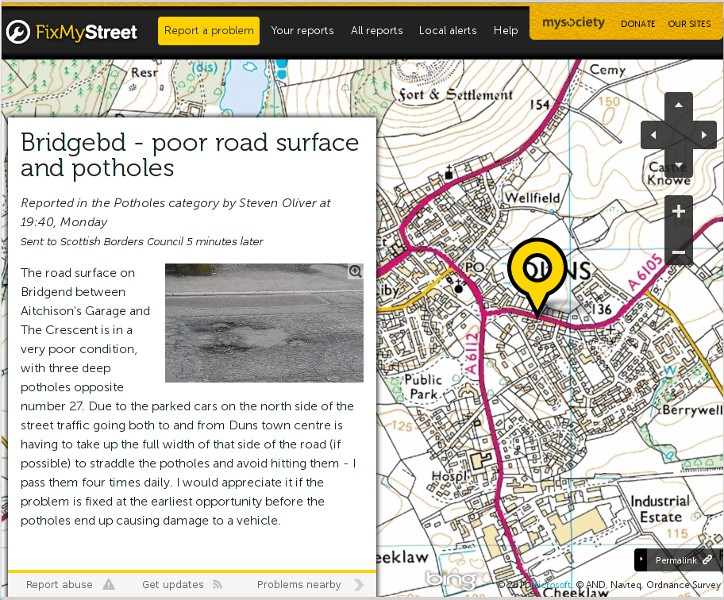

!SLIDE
# FixMyTransport
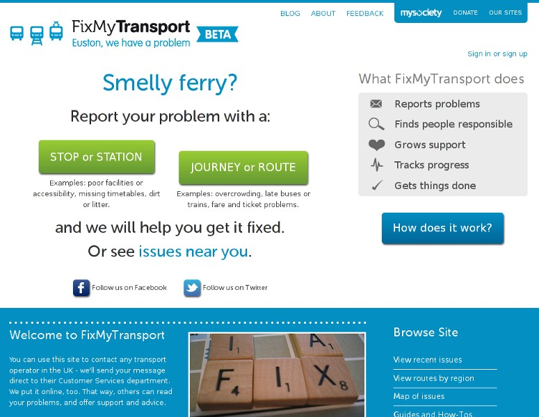

!SLIDE
# TheyWorkForYou
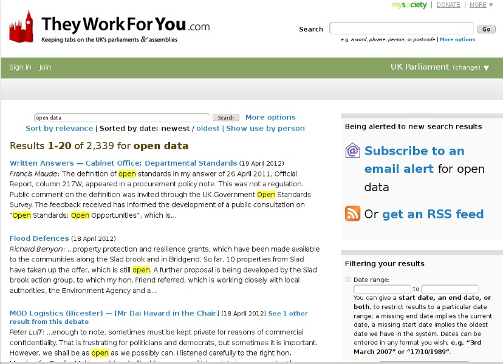

!SLIDE
# CiudadanoInteligente.cl

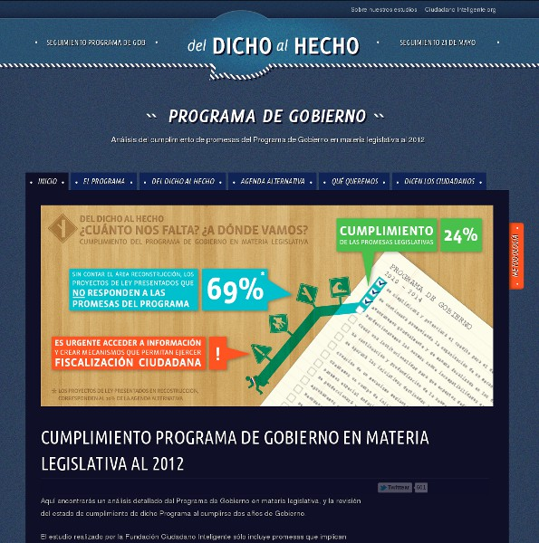

!SLIDE
# Uruguay y los datos abiertos

!SLIDE

# Los datos están:

AGESIC, Intendencia de Montevideo, plan de Acción Nacional de Gobierno Abierto...

http://gobiernoabierto.gub.uy/

!SLIDE
http://datos.gub.uy/

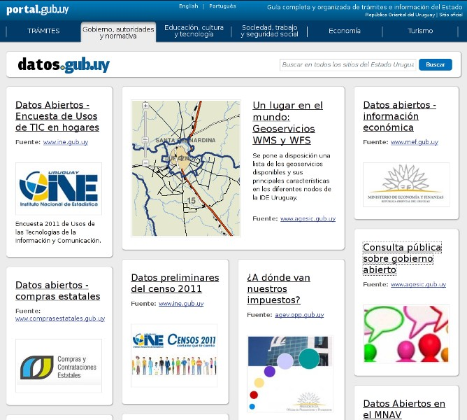

!SLIDE
Intendencia de Montevideo

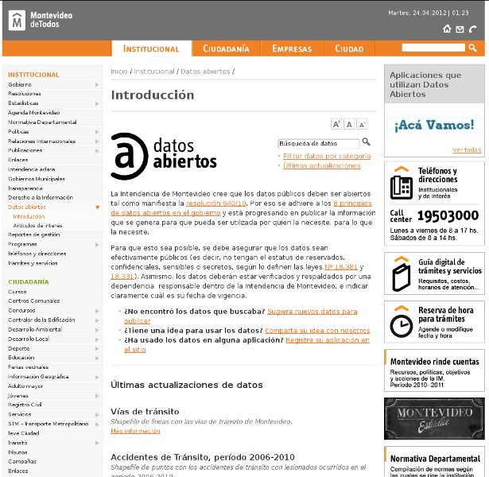

!SLIDE
¿Dónde van nuestros impuestos?

http://agev.opp.gub.uy/

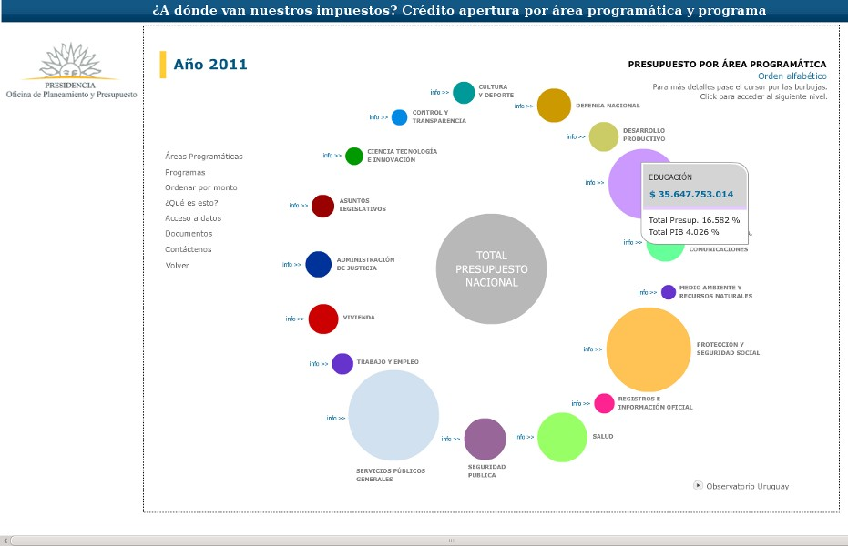

!SLIDE
# Desarrollando América Latina
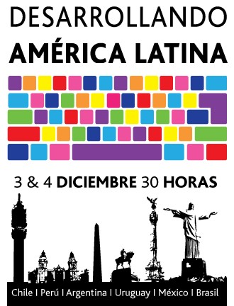

!SLIDE
# Moña Azul
Juan Manuel Pereyra, Francisco Villegas, Fernando Briano
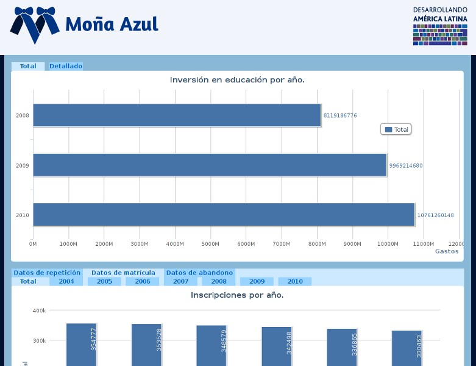

!SLIDE
# Data Pipe

Matías Parodi

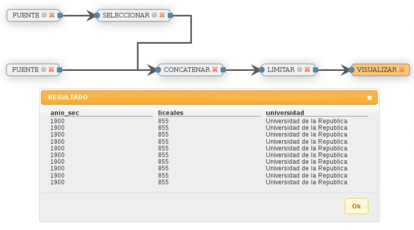

!SLIDE
# Reporte de accidentes de tránsito

Sergio García Spaolonzi, Horacio Zamora, Sylvia Sánchez

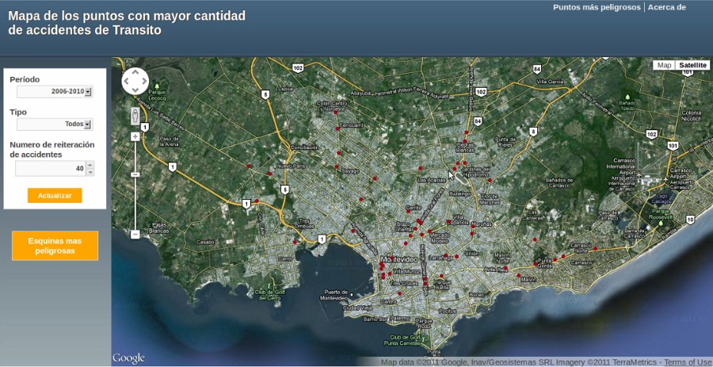

!SLIDE
# Gobierno Transparente

Andrés Ambrois, Álvaro Mouriño, Francisco Castro, Lucía Escanellas, Michael Cetrullo, Verónica Rebagliatte

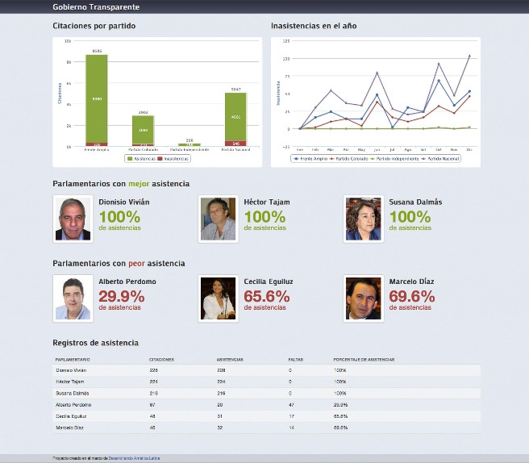

!SLIDE
# Los datos están, tenemos que aprovecharlos.

!SLIDE
# La Web como herramienta de cambio social

!SLIDE

# ¡Cubox está contratando!

getintouch@cuboxlabs.com

!SLIDE
# Gracias

@picandocodigo
