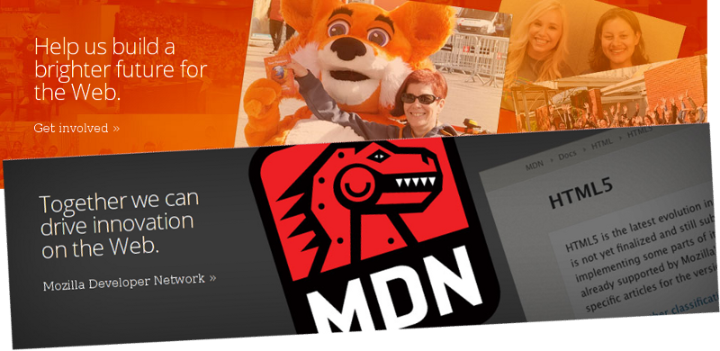

!SLIDE
# Web abierta
## Web para todos

<!SLIDE bullets incremental transition=fade>
* Estándares abiertos
* Protocolos abiertos
* Libres

!SLIDE
NO atarse a un proveedor

<!SLIDE bullets incremental transition=fade>
# Objetivos

* Integración e innovación de terceros
* Descentralización (StatusNet, Diaspora)
* Transparencia
* Comunicación bilateral